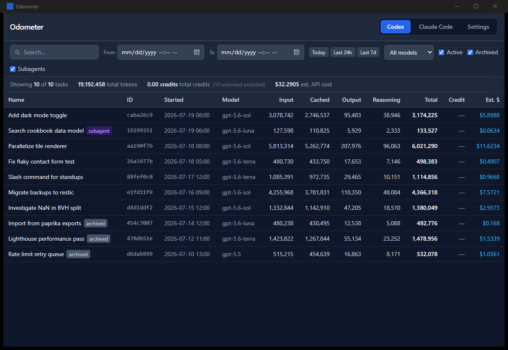
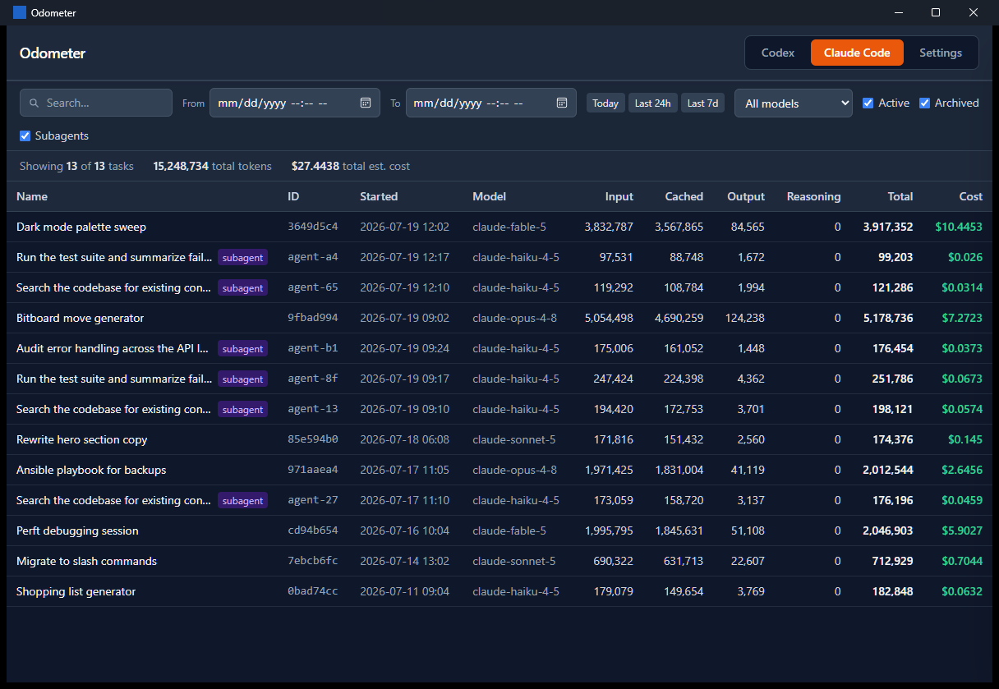
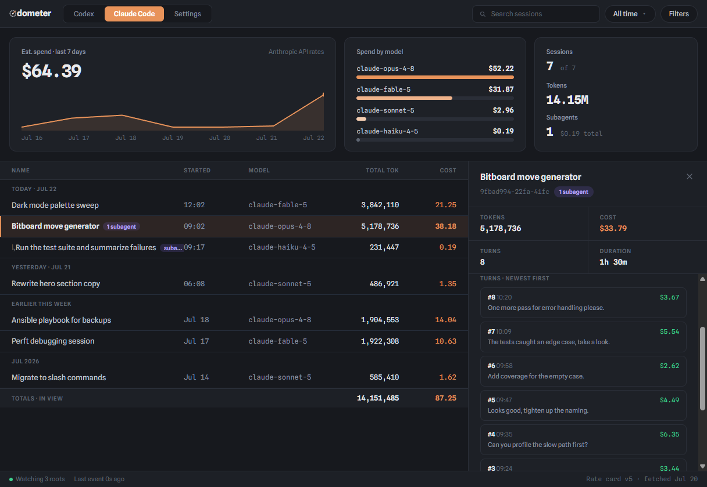

# Odometer

[](https://github.com/ekalb81/agent-odometer/actions/workflows/ci.yml)
[](https://github.com/ekalb81/agent-odometer/releases/latest)
[](https://github.com/ekalb81/agent-odometer/releases)
[](https://codecov.io/github/ekalb81/agent-odometer)
[](LICENSE)


**How far have your AI agents driven?** Odometer is a local desktop dashboard for your AI coding-agent usage. It reads the session files that [Codex](https://openai.com/codex) (OpenAI's coding agent) and [Claude Code](https://claude.com/claude-code) already write to your machine and turns them into a searchable, sortable view of every session: what you asked, which models ran, how many tokens they consumed, and what that usage costs.



Everything happens on your machine. Odometer never uploads, phones home, or sends your prompts anywhere — it only reads the local files your agents already produced (and checks GitHub for its own updates).

## What you can see

- **Every session, across harnesses** — one tab for Codex, one for Claude Code, each with totals for the sessions in view.
- **Tokens where they went** — input, cached, output, and reasoning tokens per session, per model, and per turn.
- **What it costs** — Codex sessions show plan credits *and* an informational "what would this cost at OpenAI API rates" estimate; Claude Code sessions show Anthropic API-rate estimates. Rates live in an editable rate card.
- **Turn-by-turn detail** — click any session for its full story: prompts, replies, per-turn tokens and cost, context-window fill, and a tokens-over-time sparkline.
- **Subagents included** — background agents spawned by your sessions appear as their own badged, filterable entries linked to their parent.
- **Live** — sessions update in the list while your agents are still running.
- **Time-scoped answers** — filter by date range and the token/cost columns re-total to exactly that window ("what did I burn last week?").
- **Light and dark** — follows your OS theme by default; switchable in Settings.




## Install

Download the installer for your platform from the [latest release](https://github.com/ekalb81/agent-odometer/releases/latest):

| Platform | File | Note |
| --- | --- | --- |
| Windows | `.msi` (recommended) or `-setup.exe` | Installers aren't code-signed yet; SmartScreen may warn — choose "More info → Run anyway". |
| macOS (Apple Silicon) | `.dmg` | Not notarized yet; right-click the app → Open on first launch. |
| Linux | `.AppImage` (no install) or `.deb` / `.rpm` | Mark the AppImage executable, then run it. |

Odometer checks for new releases on launch (and periodically while running) and offers a one-click in-place update.

### First run

If Codex or Claude Code is installed with default paths, there is nothing to configure — Odometer finds your sessions automatically:

- Codex: `$CODEX_HOME` if set, otherwise `~/.codex` (`sessions/`, `archived_sessions/`, `session_index.jsonl`)
- Claude Code: `$CLAUDE_CONFIG_DIR/projects` if set, otherwise `~/.claude/projects`

Custom locations can be added under **Settings → Watched roots**.

## Privacy

Session files contain your prompts, the agents' replies, tool output, and local file paths. Odometer processes them entirely locally and stores nothing outside your machine: settings live in your OS config directory (`agent-odometer/config.json`, plus `rates.json` if you customize rates). Treat the session files themselves as sensitive — don't share or commit them.

## How costs are estimated

Costs are computed from token counts against a bundled, editable rate card (per one million tokens):

- **Codex** usage is priced in plan credits per the OpenAI Codex rate card, with documented Fast-mode multipliers applied per event. A second column estimates the same usage at OpenAI **API** USD rates — informational if you're on a subscription, but useful for comparison.
- **Claude Code** usage is priced at Anthropic API USD rates. Cache reads are billed at the cached-input rate; cache *writes* (1.25×) aren't modeled, so estimates run slightly low. Thinking tokens are billed as ordinary output, matching Anthropic's billing.
- Unknown models fall back to a configurable per-harness fallback rate and are flagged in the UI.

Edit any rate under **Settings → Rate card**; your overrides persist and automatically inherit newly bundled models on upgrades.

---

## Development

Built with Tauri 2 + Rust (filesystem, parsing, IPC) and Svelte 5 + TypeScript + Tailwind (UI). See [docs/ARCHITECTURE.md](docs/ARCHITECTURE.md) for data flow, wire contracts, invariants, and known limitations.

Prerequisites: Node.js 22, stable Rust (MSRV 1.77), and the [Tauri 2 platform prerequisites](https://v2.tauri.app/start/prerequisites/).

```powershell
npm ci
npm run tauri dev
```

| Command | Purpose |
| --- | --- |
| `npm run tauri dev` | Run the desktop app with hot reload |
| `npm run dev` | Frontend dev server only (port 1420; no native IPC — a fixture mock supplies demo data in plain browsers) |
| `npm run check` | Type-check TypeScript and Svelte |
| `npm run build` | Build the frontend into `dist/` |
| `npm run tauri build` | Build and bundle the desktop app |

Match CI before handing off:

```powershell
npm run check
npm run build
cargo fmt --manifest-path src-tauri/Cargo.toml --check
cargo clippy --manifest-path src-tauri/Cargo.toml --all-targets --locked -- -D warnings
cargo test --manifest-path src-tauri/Cargo.toml --locked
```

Parser integration tests and synthetic fixtures live in `src-tauri/tests/`; never commit real session data. Set `RUST_LOG` (e.g. `$env:RUST_LOG = 'odometer_lib=info'`) for native tracing.

### Repository layout

```text
src/                     Svelte frontend
  components/            Views and reusable UI
  lib/ipc.ts             Typed Tauri command/event boundary
  lib/types.ts           TypeScript mirrors of Rust wire models
  lib/credits.ts         Credit / API-cost calculations
src-tauri/
  src/                   Rust application modules (scanner, parsers, watcher, commands)
  tests/                 Parser integration tests and fixtures
  capabilities/          Tauri permissions
  rates.json             Bundled rate card
  tauri.conf.json        Desktop build/window/updater configuration
```

Generated schemas under `src-tauri/gen/schemas/` are not hand-edited. Both lockfiles stay committed.

### Releases (maintainers)

Cutting a release, in order:

```sh
gh release create vX.Y.Z --draft --title "Odometer vX.Y.Z" --notes "…"   # pre-create the draft
git tag vX.Y.Z main && git push origin vX.Y.Z                            # triggers the build
```

The workflow builds Windows/macOS/Linux bundles and uploads them (plus updater `.sig` files and `latest.json`) into the existing draft; review and publish it when the run completes. The pre-created draft matters: since the repository went public, `GITHUB_TOKEN` can upload assets to an existing release but is blocked from creating one. Updater packages are minisign-signed — the workflow needs the `TAURI_SIGNING_PRIVATE_KEY` and `TAURI_SIGNING_PRIVATE_KEY_PASSWORD` secrets. The in-app updater follows the latest published release. OS code signing/notarization is not configured yet.

## Contributing

Issues and pull requests welcome — see [CONTRIBUTING.md](CONTRIBUTING.md) for setup, the pre-PR checklist, and the one hard rule: never include real session data. Security issues go through [private reporting](SECURITY.md).

## License

[MIT](LICENSE)
