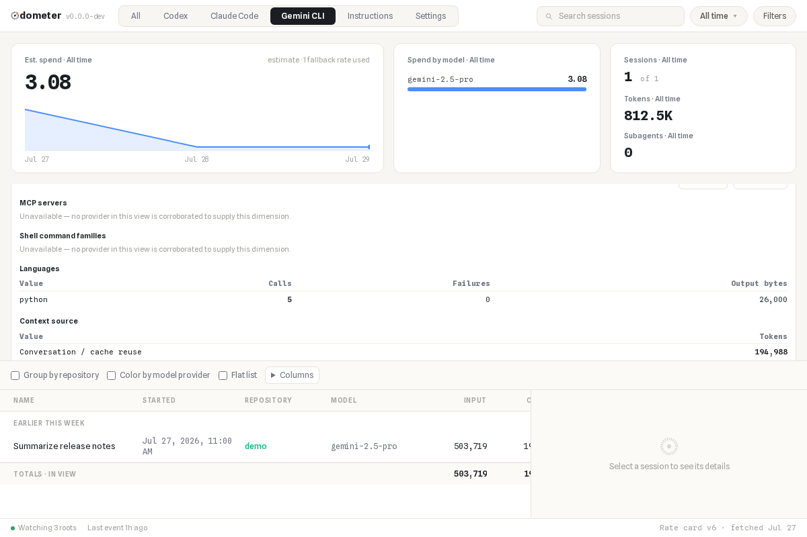

# Odometer

[](https://github.com/ekalb81/agent-odometer/actions/workflows/ci.yml)
[](https://github.com/ekalb81/agent-odometer/releases/latest)
[](https://codecov.io/github/ekalb81/agent-odometer)
[](LICENSE)


**How far have your AI agents driven?** Odometer is a local desktop dashboard for your AI coding-agent usage. It reads the session files that [Codex](https://openai.com/codex) (OpenAI's coding agent), [Claude Code](https://claude.com/claude-code), and [Gemini CLI](https://github.com/google-gemini/gemini-cli) already write to your machine and turns them into a searchable, sortable view of every session: what you asked, which models ran, how many tokens they consumed, and what that usage costs.


Everything happens on your machine. Odometer never uploads, phones home, or sends your prompts anywhere — it only reads the local files your agents already produced (and checks GitHub for its own updates).

## What you can see

- **Every session, across providers** — Codex, Claude Code, Gemini CLI, and an All tab that keeps credits and USD estimates explicitly separated.
- **Per-project spend** — working directories resolve to a stable project identity (repository root, workspace root, provider project id, or the path itself), so linked worktrees collapse into one project while nested repos and monorepo subfolders stay distinct. Sort, group, and filter by it.
- **Quota windows and budgets** — subscription and credit windows with reset timing, pace, and projected run-out, plus soft per-provider and per-project budgets with local alerts. Windows with unlike units are never summed together, and a projection is suppressed rather than guessed when the evidence is too thin.
- **Where tool overhead goes** — calls attributed by origin (core, MCP, provider), MCP server, allowlisted shell-command family, language, and context source, with exportable totals.
- **Tokens where they went** — input, cached, output, and reasoning tokens per session, per model, and per turn.
- **What it costs** — Codex sessions show plan credits *and* an informational "what would this cost at OpenAI API rates" estimate; Claude Code and Gemini CLI sessions show API-rate estimates in USD. Rates live in an editable rate card, and every priced figure carries its provenance: priced directly, resolved through a model alias, fallback-priced, estimated, or explicitly unpriced.
- **Turn-by-turn detail** — click any session for its full story: prompts, replies, per-turn tokens and cost, context-window fill, and a tokens-over-time sparkline.
- **Subagents included** — background agents spawned by your sessions appear as their own badged, filterable entries linked to their parent.
- **Live** — sessions update in the list while your agents are still running.
- **Time-scoped answers** — filter by date range and the token/cost columns re-total to exactly that window ("what did I burn last week?").
- **Export and compare** — save the exact filtered projection as CSV/JSON and compare every model's token mix, cost, calls, retries, failures, and one-shot mutation rate.
- **Local efficiency signals** — normalized tool metrics, deterministic task categories, prioritized optimization opportunities with turn-level evidence and next actions, configuration-change correlations, and opt-in local Git outcome scans never retain raw tool arguments or output.
- **Tool impact comparison** — choose any observed tool provider or individual tool and compare turns where it was used with turns where it was not observed; when enough data exists, Odometer matches the baseline by harness, model, task category, and nearby time before comparing tokens and elapsed time.
- **Optional instruction inventory** — enable a hideable Instructions tab to find `AGENTS.md` and `CLAUDE.md` files across global, observed-project, and explicitly configured roots; review nested effective chains, deterministic warning signals, sanitized Markdown previews, and linked before/after usage evidence. Discovery is read-only, cancellable, progress-visible, bounded, and off by default.
- **Provider diagnostics** — one report per provider covering configured roots, files discovered and parsed, parse failures, cache and history health, pricing coverage, and quota-source status. Each provider resolves to `ready`, `degraded`, `unsupported`, or `not_detected` with a reason. The local view shows your exact paths; the exportable bug-report JSON redacts them by default.
- **Opt-in performance evidence** — default-off local timings cover startup, scans/cache/parsers, analytics, exports, and UI work; logs are size-bounded and exportable as JSONL or CSV.
- **Opt-in turn receipts** — add a reversible Codex or Claude Code `Stop` hook that shows the completed turn's tokens and estimated cost inside the harness. Codex receipts also preserve provider-reported quota precision and label per-turn changes as account-wide observations.
- **Quick glance** — the tray menu mirrors today's tokens, Codex credits/API estimate, and Claude USD with native show, hide, settings, and quit controls.
- **Light and dark** — follows your OS theme by default; switchable in Settings.


Dimensions a provider cannot supply say so, rather than reporting zero. Here the Gemini CLI tab shows real language and context-source totals beside an explicit "Unavailable" for MCP servers and shell command families, and flags that one model fell back to an estimated rate:



## Install

Download the installer for your platform from the [latest release](https://github.com/ekalb81/agent-odometer/releases/latest):

| Platform | File | Note |
| --- | --- | --- |
| Windows | `.msi` (recommended) or `-setup.exe` | Installers aren't code-signed yet; SmartScreen may warn — choose "More info → Run anyway". |
| macOS (Apple Silicon) | `.dmg` | Not notarized yet; right-click the app → Open on first launch. |
| Linux | `.AppImage` (no install) or `.deb` / `.rpm` | Mark the AppImage executable, then run it. |

Odometer checks for new releases on launch (and periodically while running) and offers a one-click in-place update.

The UI follows Tailwind 4's browser floor: Chrome, Edge, and WebView2 111+, Safari and WKWebView 16.4+, or Firefox 128+. Linux packages likewise require a current WebKitGTK system webview with equivalent CSS support. Older embedded webviews are unsupported, so keep the operating system webview current.

### First run

If Codex or Claude Code is installed with default paths, there is nothing to configure — Odometer finds your sessions automatically:

- Codex: `$CODEX_HOME` if set, otherwise `~/.codex` (`sessions/`, `archived_sessions/`, `session_index.jsonl`)
- Claude Code: `$CLAUDE_CONFIG_DIR/projects` if set, otherwise `~/.claude/projects`
- Gemini CLI: `~/.gemini/tmp`. Gemini CLI documents no environment override for this root, so Odometer honors none rather than inventing one. Only the JSONL session format (CLI 0.39 and later) is read; the older single-JSON-document format is skipped because it cannot be parsed incrementally without risking a partial read.

Custom locations can be added under **Settings → Watched roots**.

Cursor, GitHub Copilot, and OpenCode are **not** supported. Each was evaluated and rejected on evidence rather than effort: Cursor reports no real token counts in recent versions, Copilot's only source with an input/output split is an internal trace database that is not always present, and OpenCode spreads a session across many files in a shape the incremental parser cannot follow. Odometer would have to estimate, and an estimate presented as a measurement is worse than no support.

On first launch after an upgrade that changes the history schema, the window opens immediately and analytics report that history is still preparing while the database migrates in the background. A large history can take a while; the app stays usable and never reports partial totals as if they were complete.

The separate **Settings → Instruction inventory** section accepts project or project-container roots and lets each root scan only that folder or include subfolders. Recursive discovery skips common dependency, generated-output, and VCS directories instead of crawling every file on the machine.

### Turn receipts

Turn receipts are disabled by default. To enable them, open **Settings → Turn receipts**, select
Codex and/or Claude Code, and choose **Save setup**. Odometer adds one identifiable `Stop` hook to
the selected user-level harness configuration while preserving unrelated settings and hooks.

- For Codex, Odometer keeps an existing Odometer hook in its current source. For a new setup it
  uses the `[[hooks.Stop]]` representation in `config.toml` when those inline hooks already exist;
  otherwise it uses `hooks.json`. Repair removes duplicate Odometer-owned handlers instead of
  leaving both representations active. Symlinked configs and other valid inline-array TOML shapes
  fail closed with manual setup guidance rather than being replaced or creating a second source.
- In Codex, open `/hooks` once after setup to inspect and trust the command. New or changed
  non-managed hooks do not run until Codex records that trust.
- Claude Code user settings cover the CLI and local Desktop Code sessions. Use `/hooks` to inspect
  the command. Odometer uses Claude's direct executable plus `args` form so paths with spaces do not
  depend on shell quoting; this requires Claude Code 2.1.139 or later. Remote and SSH sessions use
  the settings on their host and must be configured there.
- A running AppImage records its absolute AppImage launcher only when the process is actually inside
  the matching mounted `APPDIR`; other launches use the current executable path.
- Start a fresh harness task when status recommends it; an existing session may not reload changed
  configuration automatically.
- **Refresh status** distinguishes a configured hook from a receipt observed after that user-level
  configuration was written, and shows its source, last run, and last receipt. Managed or
  project-level policy can subsequently block a user hook without changing that historical
  observation. **Repair setup** reconciles missing, stale, or duplicate Odometer-owned entries.

Setup rechecks each source immediately before a platform-atomic replacement. An edit visible at the
configured path before replacement aborts setup. The prior file stays in a random recovery path
until the settings transaction commits. Commit atomically detaches that recovery name before its
final check; an already-open-handle edit visible in that check is preserved and reported. Writes
racing the final verification or arriving afterward follow normal operating-system open-handle
semantics.

The helper receives the harness-provided transcript path, verifies that it is a JSONL file inside
Odometer's configured roots, and parses that exact file. It exits successfully on every error and
never asks the agent to continue. Turning the feature off removes only Odometer-owned hook entries;
when disabled, the ordinary watcher/UI path is unchanged and no receipt helper runs.

## Privacy

Session files contain your prompts, the agents' replies, tool output, and local file paths. Odometer processes them entirely locally and stores nothing outside your machine: settings and rate overrides live under the OS config directory, while the scan cache, the durable history database, and redacted configuration-event hashes live under the OS cache/data directories. Tool telemetry stores hashed target identities and byte counts, never raw arguments or output.

**The durable history database keeps parsed message text.** Odometer stores a snapshot of each parsed session so analytics survive restarts and stay fast, and that snapshot includes the first user message and each turn's user message and last agent message — the same text that backs session names and search. It is local application data and inherits the same no-upload, no-log handling as the transcripts it was parsed from, but it is worth knowing it exists: treat that database as sensitive in the same way you treat the session files themselves. Aggregates, exports, diagnostics, and performance logs exclude prompt and reply text, raw tool arguments and output, credentials, and unrestricted paths. Optional application performance tracking is off by default and stores only operation timings, success flags, and aggregate counts — never prompts, session IDs, paths, commands, tool arguments, or output. Its rotating local JSONL can be exported from Settings. Treat the session files themselves as sensitive — don't share or commit them.

When turn receipts are enabled, Odometer stores one bounded local health record per harness: the
last run time, success state, and rendered receipt or a sanitized error category. It does not store
the hook's session ID, transcript path, prompt, or response.

## How costs are estimated

Costs are computed from token counts against a bundled, editable rate card (per one million tokens):

- **Codex** usage is priced in plan credits per the OpenAI Codex rate card, with documented Fast-mode multipliers applied per event. A second column estimates the same usage at OpenAI **API** USD rates — informational if you're on a subscription, but useful for comparison.
- **Claude Code** usage is priced at Anthropic API USD rates. Cache reads and cache *writes* are two disjoint subsets of input with their own rates — the write premium (1.25×) is now priced rather than folded into ordinary input. Thinking tokens are billed as ordinary output, matching Anthropic's billing.
- **Gemini CLI** usage is priced at Gemini API USD rates; thinking tokens bill at the output rate. Gemini 2.5 Pro is deliberately left unpriced because its published rate depends on a prompt-size threshold this flat per-model table cannot express — it is fallback-priced and flagged rather than guessed.
- A model with no published rate for a dimension prices that dimension at the ordinary input rate and marks the result estimated. It is never silently priced at zero, which would understate the total while still looking like a number.
- Unknown models fall back to a configurable per-provider fallback rate and are flagged in the UI. Models explicitly listed as unpriced are excluded and named instead of being assigned an unrelated fallback price.

Edit any rate under **Settings → Rate card**; your overrides persist and automatically inherit newly bundled models on upgrades.

---

## Development

Built with Tauri 2 + Rust (filesystem, parsing, IPC) and Svelte 5 + TypeScript + Tailwind (UI). See [docs/ARCHITECTURE.md](docs/ARCHITECTURE.md) for data flow, wire contracts, invariants, and known limitations.

Visual regression coverage and baseline-update guidance lives in [docs/VISUAL_TESTING.md](docs/VISUAL_TESTING.md).

Prerequisites: Node.js 22.22.2 or later (see `engines` in `package.json` and `.nvmrc` — jsdom 30 raised the floor, and CI's floating `node-version: 22` will not warn you if your local Node is older), Rust 1.95 or later, and the [Tauri 2 platform prerequisites](https://v2.tauri.app/start/prerequisites/).

```powershell
npm ci
npm run tauri dev
```

| Command | Purpose |
| --- | --- |
| `npm run tauri dev` | Run the desktop app with hot reload |
| `npm run dev` | Frontend dev server only (port 1420; no native IPC — a fixture mock supplies demo data in plain browsers) |
| `npm run check` | Type-check TypeScript and Svelte |
| `npm test` | Run frontend unit and component tests with Vitest |
| `npm run test:coverage` | Run frontend tests and enforce the source-backed initial coverage slice |
| `npm run build` | Build the frontend into `dist/` |
| `npm run tauri build` | Build and bundle the desktop app |
| `npm run visual:test` | Run deterministic Playwright screenshot comparisons |
| `npm run visual:update` | Review and intentionally update Playwright baselines (Linux only; use the pinned container elsewhere) |
| `npm run visual:gallery` | Build an HTML gallery from current Playwright screenshots |
| `npm run visual:docs:update` | Copy selected current images into `docs/screenshots/` (add `-- --force` to replace reviewed files) |
| `npm run version:bump -- <major\|minor\|patch\|X.Y.Z>` | Rewrite all five version manifests together and verify they agree |

The docs screenshot command is an explicit local action: it copies reviewed images from `output/playwright/current`, refuses to overwrite without `--force`, and is never run automatically in CI.

Match CI before handing off:

```powershell
npm run check
npm test
npm run build
cargo fmt --manifest-path src-tauri/Cargo.toml --check
cargo clippy --manifest-path src-tauri/Cargo.toml --all-targets --locked -- -D warnings
cargo test --manifest-path src-tauri/Cargo.toml --locked
```

Frontend tests live beside the modules and components they cover as `*.test.ts`. Parser integration tests and synthetic fixtures live in `src-tauri/tests/`; never commit real session data. Set `RUST_LOG` (e.g. `$env:RUST_LOG = 'odometer_lib=info'`) for native tracing.

### Repository layout

```text
src/                     Svelte frontend
  components/            Views and reusable UI
  lib/ipc.ts             Typed Tauri command/event boundary
  lib/types.ts           TypeScript mirrors of Rust wire models
  lib/credits.ts         Credit / API-cost calculations
  lib/sessionProjection.ts Shared filter, pricing, model-comparison, and export projection
src-tauri/
  src/                   Rust parsers, telemetry, correlation, config events, git outcomes, tray, and commands
    history_store.rs     Durable SQLite history: facts, hour-bucket rollups, migrations
    provider.rs          Provider registry, adapter contract, capability flags
    project_identity.rs  Working directory to stable project identity
    quota.rs             Quota windows, pace, budgets, alerts
    diagnostics.rs       Per-provider health and data-quality report
    paths.rs             Shared path normalization (Windows verbatim and UNC)
  tests/                 Parser integration tests and fixtures
  capabilities/          Tauri permissions
  rates.json             Bundled rate card
  tauri.conf.json        Desktop build/window/updater configuration
docs/adr/                Architecture decision records (sync design gate)
```

Generated schemas under `src-tauri/gen/schemas/` are not hand-edited. Both lockfiles stay committed.

### Releases (maintainers)

Cutting a release, in order:

```sh
git switch main
git pull --ff-only origin main
git tag -s vX.Y.Z -m "Odometer vX.Y.Z" main  # annotated tag signed with your Git signing key
git push origin vX.Y.Z                        # triggers the cross-platform build
```

Bump the version first, on a normal PR, with `npm run version:bump -- <major|minor|patch|X.Y.Z>`. It rewrites all **five** manifests together — `package.json`, `package-lock.json`, `src-tauri/Cargo.toml`, `src-tauri/Cargo.lock`, and `src-tauri/tauri.conf.json` — refuses a non-increasing version, and verifies they agree. Preflight only compares three of them (`package.json`, `Cargo.toml`, `tauri.conf.json`), so the two lockfiles can drift silently if edited by hand; that is why the script exists.

All three checked version fields must already equal `X.Y.Z`; the release workflow rejects a mismatched `vX.Y.Z` tag before any platform builds start. The tagged commit must also have a successful CI run.

A repository ruleset forbids updating **or deleting** tag refs. A tag pushed at the wrong commit is permanently unusable and its version number is burned, so never tag before the bump commit is on `main` with green CI.

GitHub generates draft release notes from merged pull requests. Work that lands directly on `main` is invisible to that generator, so read the draft's notes and rewrite them from the actual commit range before publishing. Notes are only editable while the release is a draft. `git tag -s` creates an annotated, cryptographically signed Git tag; this Git signature is separate from the updater artifact signature.

The workflow creates or validates one mutable draft release during preflight, then builds and signs macOS, Linux, and Windows bundles in parallel without allowing matrix jobs to write the GitHub release or `latest.json`. After all platform builds succeed, one publisher downloads the one-day workflow artifacts, validates and uploads the exact signed asset set, and assembles and uploads a single complete `latest.json`. A final job downloads the draft manifest and validates its Tauri field types, release notes, complete signed platform map, asset names, sizes, SHA-256 digests, release ownership, tag, and exact commit. Do not create or publish the GitHub release manually before the workflow finishes: a published release is immutable and cannot accept corrected assets. Publish only after every release job succeeds. Updater packages are minisign-signed — the workflow needs the `TAURI_SIGNING_PRIVATE_KEY` and `TAURI_SIGNING_PRIVATE_KEY_PASSWORD` secrets. The in-app updater follows the latest published release. OS code signing/notarization is not configured yet. A manual Actions run is build-only: it validates the three internal versions and bundles every platform, but never creates a tag or GitHub release.

## Contributing

Issues and pull requests welcome — see [CONTRIBUTING.md](CONTRIBUTING.md) for setup, the pre-PR checklist, and the one hard rule: never include real session data. Security issues go through [private reporting](SECURITY.md).

## License

[MIT](LICENSE)
