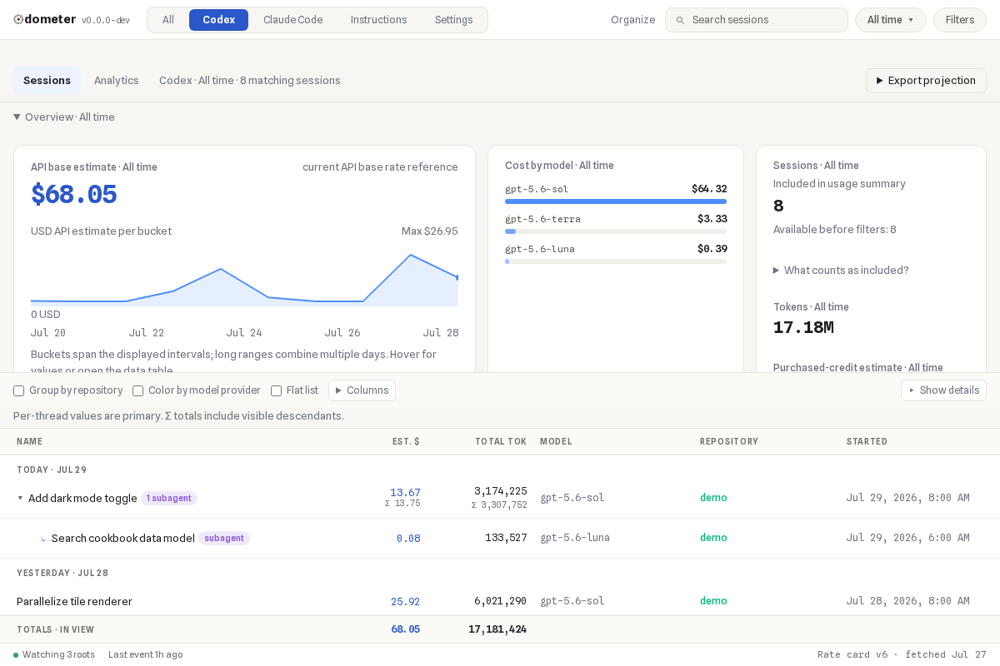
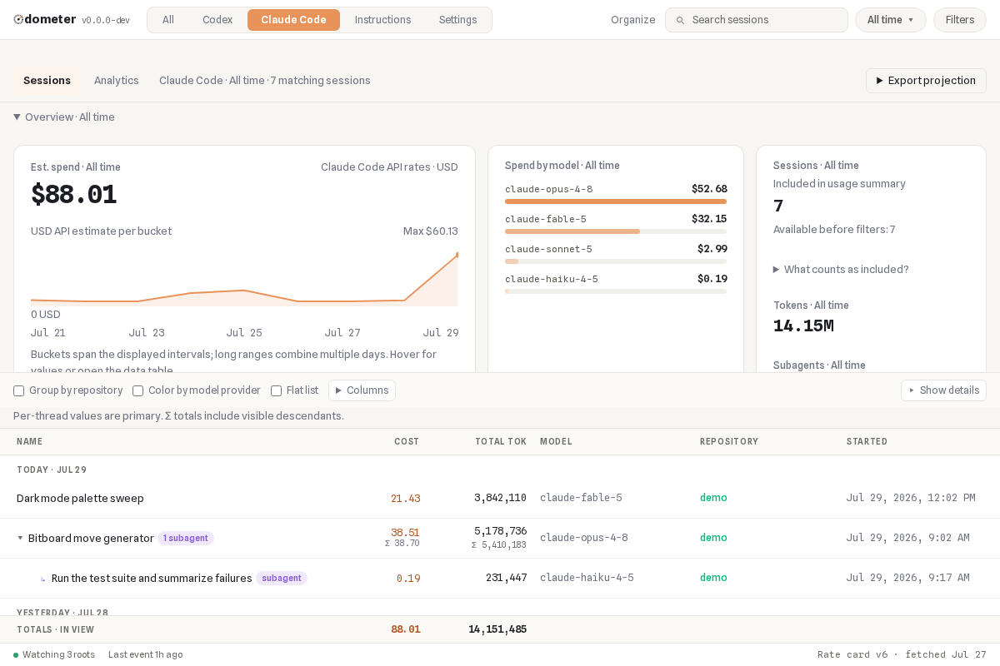
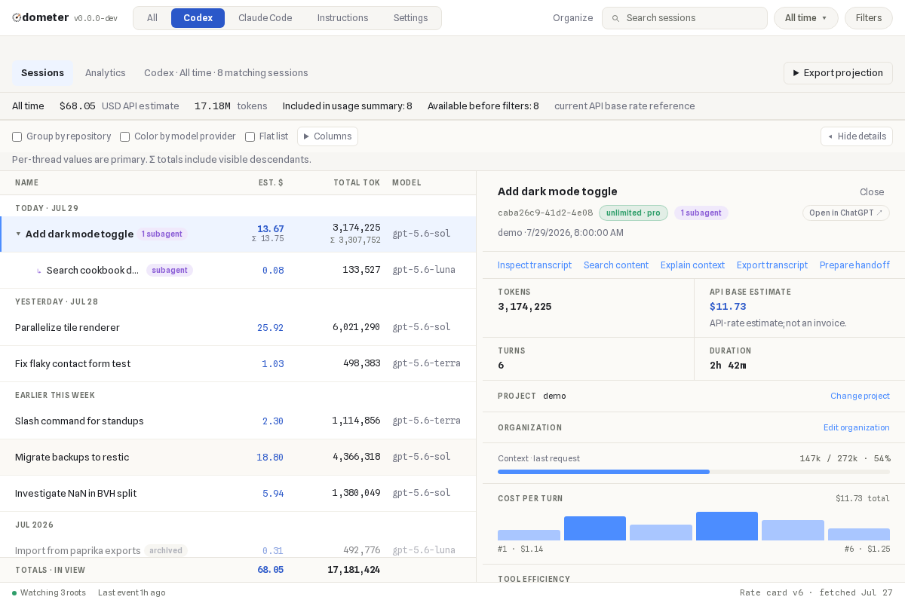
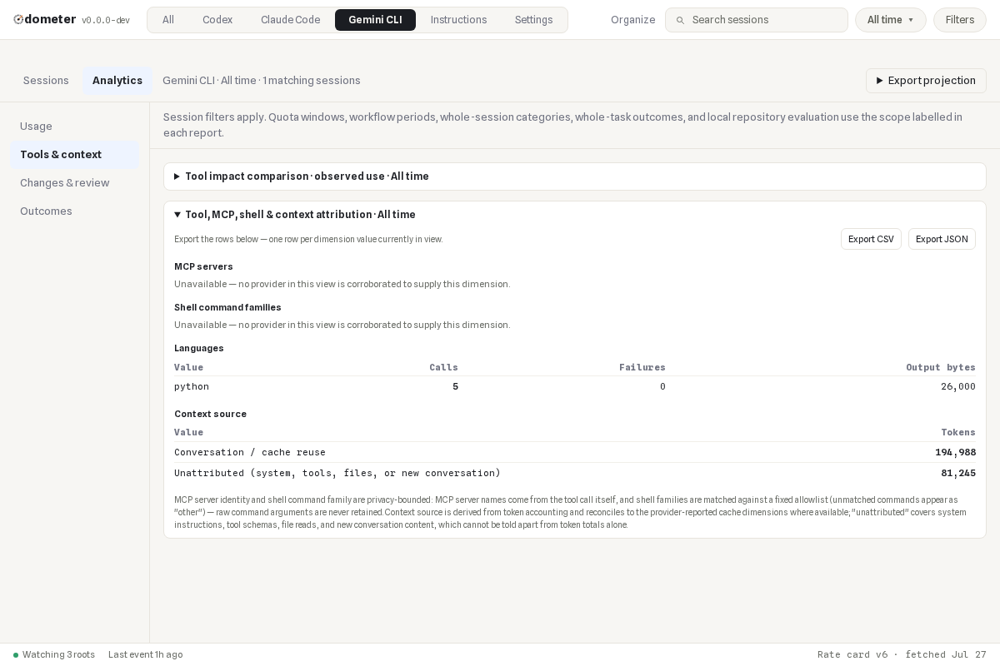

# Odometer

[](https://github.com/ekalb81/agent-odometer/actions/workflows/ci.yml)
[](https://github.com/ekalb81/agent-odometer/releases/latest)
[](https://codecov.io/github/ekalb81/agent-odometer)
[](LICENSE)


**How far have your AI agents driven?** Odometer is a local desktop dashboard for your AI coding-agent usage. It reads the session files that [Codex](https://openai.com/codex) (OpenAI's coding agent), [Claude Code](https://claude.com/claude-code), and [Gemini CLI](https://github.com/google-gemini/gemini-cli) already write to your machine and turns them into a searchable, sortable view of every session: what you asked, which models ran, how many tokens they consumed, and what that usage costs.



Usage history and pricing stay on your machine. Odometer reads local session files and checks GitHub for app updates. Public provider status is optional and off by default; live quota checks require separate account consent. Neither feature uploads session content.

## What you can see

- **Every session, across providers** — Codex, Claude Code, Gemini CLI, and an All tab that keeps credits and USD estimates explicitly separated.
- **Per-project spend** — working directories resolve to a stable project identity (repository root, workspace root, provider project id, or the path itself), so linked worktrees collapse into one project while nested repos and monorepo subfolders stay distinct. Sort, group, and filter by it. Use **Change project** in session details to move one session, make it standalone, or restore detection; manage project names and merges in Settings.
- **Public provider status** — an optional Settings panel reads fixed OpenAI and Claude public status endpoints while open, without credentials or session data. Failed, stale, and unsupported sources stay unavailable; status never changes accounting. [Status sources and boundaries](docs/PROVIDER_STATUS.md).
- **Quota windows and budgets** — transcript observations with reset timing, pace, and projected run-out; editable provider/project token and USD API-estimate budgets; opt-in local alerts. Codex live quota uses a separately approved account through the installed native CLI. Account changes stop readings until separately approved, and unavailable sources never become zero usage. [Quota sources and consent](docs/QUOTAS.md).
- **Compact local widget** — an optional app window for recorded quota observations or cumulative available-source usage, with explicit observation age and partial coverage. It works with live polling disabled. [Widget scope and platform limits](docs/LOCAL_WIDGET.md).
- **Where tool overhead goes** — calls attributed by origin (core, MCP, provider), MCP server, allowlisted shell-command family, language, and context source, with exportable totals.
- **Tokens where they went** — input, cached, output, and reasoning tokens per session, per model, and per turn.
- **What it costs** — Codex sessions show plan credits *and* an informational "what would this cost at OpenAI API rates" estimate; Claude Code and Gemini CLI sessions show API-rate estimates in USD. Rates live in an editable rate card, and every priced figure carries its provenance: priced directly, resolved through a model alias, fallback-priced, estimated, or explicitly unpriced.
- **Turn-by-turn detail** — click any session for its full story: prompts, replies, per-turn tokens and cost, context-window fill, and a tokens-over-time sparkline.
- **Source inspection** — select a session and choose **Inspect transcript** for bounded source-order pages, explicit tool links, and recorded edits. See [Transcript inspector](docs/TRANSCRIPT_INSPECTOR.md).
- **Offline transcript export** — choose **Export transcript**, build a sanitized HTML preview, review it, then save to a local destination. Tool content is excluded by default; optional tool/reasoning content still passes heuristic redaction. Attachments and unknown source records are omitted. Missing or bounded source reads stay labeled incomplete; automatic redaction is not exhaustive.
- **Reviewed handoff packets** — choose **Prepare handoff**, explicitly select retained fields or bounded original records, and add your own task-state note. Review the redacted preview before copying Markdown or saving HTML. Tools are opt-in, incomplete source stays labeled, and parent/subagent content is excluded. Preparing a handoff never launches an agent or runs a command.
- **Conversation search** — choose **Search content** in a selected session for bounded message search, explicit tool-body scopes, exact source anchors, and separately labeled retained-message fallback. See [Session content search](docs/TRANSCRIPT_SEARCH.md).
- **Execution comparison** — choose **Compare execution** from a session's context menu for an ephemeral board of up to eight sessions, recorded UTC activity, unresolved relationship evidence, and two bounded source inspectors. See [Execution board](docs/EXECUTION_BOARD.md).
- **Context evidence** — choose **Explain context** for recorded contributor categories, compaction boundaries, per-call observations, exact source anchors, and explicit coverage limits. See [Context explanation](docs/CONTEXT_EXPLANATION.md).
- **Subagents included** — background agents spawned by your sessions appear as their own badged, filterable entries linked to their parent.
- **Live** — sessions update in the list while your agents are still running.
- **Retained history** — missing or replaced transcripts keep local usage and clearly marked session summaries. Settings offers a reviewed, typed purge and preservation-first corrupt-history recovery; partial recovery remains labeled incomplete. See [history lifecycle](docs/HISTORY_LIFECYCLE.md).
- **Codex speed** — open **Codex → Analytics & exports → Codex speed** for Today, 7-day, and 14-day reports, Fast/Standard comparisons, model and reasoning filters, and CSV export. The default turn throughput uses session-log tokens and recorded turn durations, including tools, reasoning, and waiting; recorded time to first token is shown when available. An optional response view uses retained local SQLite telemetry. The two measurements stay separate, and neither measures pure decoding or accepted-task delivery. Missing timing or mode evidence is labeled unavailable or unknown. See [measurement details](docs/CODEX_SPEED.md).
- **Time-scoped answers** — filter by date range and the token/cost columns re-total to exactly that window ("what did I burn last week?").
- **Calendar and daily trends** — open **Analytics & exports → Calendar & daily trend** for token or tool-call activity in the current provider/session scope. Select an effective project and local or UTC calendar days, then click a day to list its event sessions. The default covers 90 days; explicit date ranges support up to 366 days. Partial history stays labeled, and unknown history never becomes a zero. Activity volume does not measure productivity.
- **Local activity cards** — choose **Preview summary card** in the calendar to review an SVG heatmap and companion Markdown for the same measured scope, dates, metric, timezone, and history coverage. Save the exact SVG through the native file picker or copy the displayed Markdown. Project names, session identities, prompts, tool payloads, paths, and account identifiers are omitted; nothing is uploaded. A source or scope change closes the preview so a stale snapshot cannot be saved inadvertently. User-saved cards are independent files and are not removed by history retention.
- **Export and compare** — save the exact filtered projection as CSV/JSON and compare every model's token mix, cost, calls, retries, failures, and one-shot mutation rate.
- **Local efficiency signals** — normalized tool metrics, deterministic task categories, prioritized optimization opportunities with turn-level evidence and next actions, configuration-change correlations, and opt-in local Git outcome scans never retain raw tool arguments or output.
- **Explicit human outcomes** — enter accepted, rejected, unresolved, or not rated in session organization, with optional user-reported repair minutes and private repair notes. The current-filter report shows rating and first-pass evidence coverage; structured JSON export omits notes. See [measurement and privacy](docs/HUMAN_OUTCOMES.md).
- **Curated local examples** — choose one to four conversation records from an explicitly accepted or rejected session, review the exact minimized preview, and save a small versioned dataset locally. Rubrics are optional; dataset export requires a separate action. No model runs or uploads are added. See [curation and deletion](docs/CURATED_DATASETS.md).
- **Frozen offline comparisons** — review fixed dataset inputs, prompts, models, service tiers and rates, then import actual run results. Raw cost, time and human quality keep separate sample counts, failed/missing cases and condition warnings. No model execution is added. See [offline comparisons](docs/OFFLINE_COMPARISONS.md).
- **Tool impact comparison** — choose any observed tool provider or individual tool and compare turns where it was used with turns where it was not observed; when enough data exists, Odometer matches the baseline by harness, model, task category, and nearby time before comparing tokens and elapsed time.
- **Optional instruction inventory** — enable a hideable Instructions tab to find `AGENTS.md` and `CLAUDE.md` files across global, observed-project, and explicitly configured roots; review nested effective chains, deterministic warning signals, sanitized Markdown previews, and linked before/after usage evidence. Discovery is read-only, cancellable, progress-visible, bounded, and off by default.
- **Provider diagnostics** — one report per provider covering configured roots, files discovered and parsed, parse failures, cache and history health, pricing coverage, and quota-source status. Each provider resolves to `ready`, `degraded`, `unsupported`, or `not_detected` with a reason. The local view shows your exact paths; the exportable bug-report JSON redacts them by default.
- **Opt-in performance evidence** — default-off local timings cover startup, scans/cache/parsers, analytics, exports, and UI work; logs are size-bounded and exportable as JSONL or CSV.
- **Opt-in turn receipts** — add a reversible Codex/Claude Code `Stop` or Gemini CLI `AfterAgent` hook that shows the completed turn's tokens and estimated cost inside the harness. Codex receipts also preserve provider-reported quota precision and label per-turn changes as account-wide observations.
- **Quick glance** — the tray menu mirrors today's tokens, Codex credits/API estimate, and Claude USD with native show, hide, settings, and quit controls.
- **Light and dark** — follows your OS theme by default; switchable in Settings.




Dimensions a provider cannot supply say so, rather than reporting zero. Here the Gemini CLI tab shows real language and context-source totals beside an explicit "Unavailable" for MCP servers and shell command families, and flags that one model fell back to an estimated rate:



## Install

Download the installer for your platform from the [latest release](https://github.com/ekalb81/agent-odometer/releases/latest):

| Platform | File | Note |
| --- | --- | --- |
| Windows | `.msi` (recommended) or `-setup.exe` | Installers aren't code-signed yet; SmartScreen may warn — choose "More info → Run anyway". |
| macOS (Apple Silicon) | `.dmg` | Not notarized yet; right-click the app → Open on first launch. |
| Linux | `.AppImage` (no install) or `.deb` / `.rpm` | Mark the AppImage executable, then run it. |

Odometer checks for new releases on launch (and periodically while running) and offers a one-click in-place update.

The UI follows Tailwind 4's browser floor: Chrome, Edge, and WebView2 111+, Safari and WKWebView 16.4+, or Firefox 128+. Linux packages likewise require a current WebKitGTK system webview with equivalent CSS support. Older embedded webviews are unsupported, so keep the operating system webview current.

### First run

If Codex or Claude Code is installed with default paths, there is nothing to configure — Odometer finds your sessions automatically:

- Codex: `$CODEX_HOME` if set, otherwise `~/.codex` (`sessions/`, `archived_sessions/`, `session_index.jsonl`)
- Claude Code: `$CLAUDE_CONFIG_DIR/projects` if set, otherwise `~/.claude/projects`
- Gemini CLI: `~/.gemini/tmp`. Gemini CLI documents no environment override for this root, so Odometer honors none rather than inventing one. Only the JSONL session format (CLI 0.39 and later) is read; the older single-JSON-document format is skipped because it cannot be parsed incrementally without risking a partial read.

Custom locations can be added under **Settings → Watched roots**.

Cursor, GitHub Copilot CLI, OpenCode, Cline, Kilo Code, and Goose are **not** currently supported. A source-format review found promising local data for some providers, but it has not yet established stable schemas and accounting semantics that meet Odometer's event-level contracts. In particular, Cursor's published token API is for its SDK rather than desktop history; Copilot's opt-in local OpenTelemetry export needs a verified project/session join; and OpenCode's current SQLite store is internal and versioned with the app. See [additional adapter evidence](docs/ADAPTER_COMPATIBILITY.md) for the reviewed versions, source links, and bounded candidate recommendation. Odometer does not estimate missing usage.

On first launch after an upgrade that changes the history schema, the window opens immediately and analytics report that history is still preparing while the database migrates in the background. A large history can take a while; the app stays usable and never reports partial totals as if they were complete.

The separate **Settings → Instruction inventory** section accepts project or project-container roots and lets each root scan only that folder or include subfolders. Recursive discovery skips common dependency, generated-output, and VCS directories instead of crawling every file on the machine.

### Turn receipts

Turn receipts are disabled by default. To enable them, open **Settings → Turn receipts**, select
Codex and/or Claude Code, and choose **Save setup**. Odometer adds one identifiable `Stop` hook to
the selected user-level harness configuration while preserving unrelated settings and hooks.

- For Codex, Odometer keeps an existing Odometer hook in its current source. For a new setup it
  uses the `[[hooks.Stop]]` representation in `config.toml` when those inline hooks already exist;
  otherwise it uses `hooks.json`. Repair removes duplicate Odometer-owned handlers instead of
  leaving both representations active. Symlinked configs and other valid inline-array TOML shapes
  fail closed with manual setup guidance rather than being replaced or creating a second source.
- In Codex, open `/hooks` once after setup to inspect and trust the command. New or changed
  non-managed hooks do not run until Codex records that trust.
- Claude Code user settings cover the CLI and local Desktop Code sessions. Use `/hooks` to inspect
  the command. Odometer uses Claude's direct executable plus `args` form so paths with spaces do not
  depend on shell quoting; this requires Claude Code 2.1.139 or later. Remote and SSH sessions use
  the settings on their host and must be configured there.
- A running AppImage records its absolute AppImage launcher only when the process is actually inside
  the matching mounted `APPDIR`; other launches use the current executable path.
- Start a fresh harness task when status recommends it; an existing session may not reload changed
  configuration automatically.
- **Refresh status** distinguishes a configured hook from a receipt observed after that user-level
  configuration was written, and shows its source, last run, and last receipt. Managed or
  project-level policy can subsequently block a user hook without changing that historical
  observation. **Repair setup** reconciles missing, stale, or duplicate Odometer-owned entries.

Setup rechecks each source immediately before a platform-atomic replacement. An edit visible at the
configured path before replacement aborts setup. The prior file stays in a random recovery path
until the settings transaction commits. Commit atomically detaches that recovery name before its
final check; an already-open-handle edit visible in that check is preserved and reported. Writes
racing the final verification or arriving afterward follow normal operating-system open-handle
semantics.

The helper receives the harness-provided transcript path, verifies that it is a JSONL file inside
Odometer's configured roots, and parses that exact file. It exits successfully on every error and
never asks the agent to continue. Turning the feature off removes only Odometer-owned hook entries;
when disabled, the ordinary watcher/UI path is unchanged and no receipt helper runs.

## Privacy

Session files contain your prompts, the agents' replies, tool output, and local file paths. Odometer processes them entirely locally and stores nothing outside your machine: settings and rate overrides live under the OS config directory, while the scan cache, the durable history database, and redacted configuration-event hashes live under the OS cache/data directories. Tool telemetry stores hashed target identities and byte counts, never raw arguments or output.

**The durable history database keeps parsed message text.** Odometer stores a snapshot of each parsed session so analytics survive restarts and stay fast, and that snapshot includes the first user message and each turn's user message and last agent message — the same text that backs session names and search. It is local application data and inherits the same no-upload, no-log handling as the transcripts it was parsed from, but it is worth knowing it exists: treat that database as sensitive in the same way you treat the session files themselves. Aggregates, exports, diagnostics, and performance logs exclude prompt and reply text, raw tool arguments and output, credentials, and unrestricted paths. Optional application performance tracking is off by default and stores only operation timings, success flags, and aggregate counts — never prompts, session IDs, paths, commands, tool arguments, or output. Its rotating local JSONL can be exported from Settings. Treat the session files themselves as sensitive — don't share or commit them.

When turn receipts are enabled, Odometer stores one bounded local health record per harness: the
last run time, success state, and rendered receipt or a sanitized error category. It does not store
the hook's session ID, transcript path, prompt, or response.

## How costs are estimated

Costs are computed from token counts against a bundled, editable rate card (per one million tokens):

- **Codex** retains an explicitly labeled legacy credit reference. Session details also separate purchased credits, included allowance in Standard-credit equivalents, and an API estimate. Current scenarios apply the dated rules available as of the query; dated scenarios require covered event timestamps. These estimates do not infer which allowance or purchased balance paid for a request. Fast uses 2× purchased credits versus 2.5× included limits, and Astra Ultrafast uses 6× versus 8× (verified October 4, 2026). Unsupported model/tier/date combinations are unavailable. API long-context rules require recorded request input and never change Codex allowances.
- **Claude Code** usage is priced at Anthropic API USD rates. Cache reads and cache *writes* are two disjoint subsets of input with their own rates — the write premium (1.25×) is now priced rather than folded into ordinary input. Thinking tokens are billed as ordinary output, matching Anthropic's billing.
- **Gemini CLI** usage is priced at Gemini API USD rates; thinking tokens bill at the output rate. Gemini 2.5 Pro is deliberately left unpriced because its published rate depends on a prompt-size threshold this flat per-model table cannot express — it is fallback-priced and flagged rather than guessed.
- A model with no published rate for a dimension prices that dimension at the ordinary input rate and marks the result estimated. It is never silently priced at zero, which would understate the total while still looking like a number.
- Unknown models fall back to a configurable per-provider fallback rate and are flagged in the UI. Models explicitly listed as unpriced are excluded and named instead of being assigned an unrelated fallback price.

Edit any rate under **Settings → Rate card**. Upgrades refresh values matching known archived defaults and preserve differing rates and alias expiries. Retained or unverified entries are named for review; row evidence dates stay separate from the card reference date. **Reset to shipped defaults** replaces the entire card after confirmation. Gemini 3.8 Flash’s temporary flat reference expires January 1, 2027; its dated scenario records the published doubled rates. Flat estimates use current Standard paid-text reference prices, including for historical totals; other billing scenarios may remain estimated or unavailable.

New price cards arrive embedded in app updates through the existing version-bound signed updater. There is no separate card download. Settings identifies the loaded card and shows recovery failures. Validated saves atomically replace the active card and attempt to update an adjacent `rates.last-valid.json` backup. An invalid or unreadable saved card uses a valid backup, then the embedded card; reading never repairs files. A missing saved card uses the embedded defaults.

For offline FX, enable **Settings → Rate card → Offline display currency** and enter the original monetary currency, display currency, positive exchange rate, UTC timestamp and source you checked. Save the rate card to apply it. Details show the backend's converted estimate alongside the original amount and the entered evidence. This is a user-supplied restatement, not a live quote; plan credits and different original currencies are never converted or combined. Disabling FX restores original-only display.

---

## Development

Built with Tauri 2 + Rust (filesystem, parsing, IPC) and Svelte 5 + TypeScript + Tailwind (UI). See [docs/ARCHITECTURE.md](docs/ARCHITECTURE.md) for data flow, wire contracts, invariants, and known limitations.

Visual regression coverage and baseline-update guidance lives in [docs/VISUAL_TESTING.md](docs/VISUAL_TESTING.md).

Prerequisites: Node.js 22.22.2 or later (see `engines` in `package.json` and `.nvmrc` — jsdom 30 raised the floor, and CI's floating `node-version: 22` will not warn you if your local Node is older), Rust 1.95 or later, and the [Tauri 2 platform prerequisites](https://v2.tauri.app/start/prerequisites/).

```powershell
npm ci
npm run tauri dev
```

| Command | Purpose |
| --- | --- |
| `npm run tauri dev` | Run the desktop app with hot reload |
| `npm run dev` | Frontend dev server only (port 1420; no native IPC — a fixture mock supplies demo data in plain browsers) |
| `npm run check` | Type-check TypeScript and Svelte |
| `npm test` | Run frontend unit and component tests with Vitest |
| `npm run test:coverage` | Run frontend tests and enforce the source-backed initial coverage slice |
| `npm run build` | Build the frontend into `dist/` |
| `npm run tauri build` | Build and bundle the desktop app |
| `npm run mock:pricing:check` | Verify synthetic browser pricing fixtures against Rust output (requires Cargo) |
| `npm run mock:pricing:generate` | Regenerate synthetic browser pricing fixtures through Rust (requires Cargo) |
| `npm run visual:test` | Run deterministic Playwright screenshot comparisons |
| `npm run visual:update` | Review and intentionally update Playwright baselines (Linux only; use the pinned container elsewhere) |
| `npm run visual:gallery` | Build an HTML gallery from current Playwright screenshots |
| `npm run visual:docs:update` | Copy selected current images into `docs/screenshots/` (add `-- --force` to replace reviewed files) |
| `npm run version:bump -- <major\|minor\|patch\|X.Y.Z>` | Rewrite all five version manifests together and verify they agree |

The docs screenshot command is an explicit local action: it copies reviewed images from `output/playwright/current`, refuses to overwrite without `--force`, and is never run automatically in CI.

Match CI before handing off:

```powershell
npm run check
npm test
npm run build
cargo fmt --manifest-path src-tauri/Cargo.toml --check
cargo clippy --manifest-path src-tauri/Cargo.toml --all-targets --locked -- -D warnings
cargo test --manifest-path src-tauri/Cargo.toml --locked
```

Frontend tests live beside the modules and components they cover as `*.test.ts`. Parser integration tests and synthetic fixtures live in `src-tauri/tests/`; never commit real session data. Rust owns token pricing, with frozen bucket and detail expectations under `tests/conformance/`. The frontend formats and sums returned prices; browser demos use Rust-generated synthetic prices rather than a separate calculator. Ordinary browser development and visual tests use the committed fixture JSON and do not need a Rust runtime; see [the fixture workflow](docs/VISUAL_TESTING.md#local-workflow) when changing synthetic inputs or pricing. Set `RUST_LOG` (e.g. `$env:RUST_LOG = 'odometer_lib=info'`) for native tracing.

### Read-only reports

The executable also provides local reports without starting the desktop: `agent-odometer report --from 2026-09-01 --format json`, `agent-odometer tools`, and `agent-odometer statusline`. Use `agent-odometer export --report models --format markdown` for a versioned export, or `agent-odometer mcp` for the bounded, read-only stdio server. Existing JSON and CSV formats remain compatible by default. See [headless commands, export schemas, and query limits](docs/HEADLESS.md).

For an interactive terminal view, run `node packages/terminal-monitor/monitor.mjs`. The optional Host OS CPU/memory panel starts disabled. See [terminal monitor keys and source limits](docs/TERMINAL_MONITOR.md).

### Repository layout

```text
src/                     Svelte frontend
  components/            Views and reusable UI
  lib/ipc.ts             Typed Tauri command/event boundary
  lib/types.ts           TypeScript mirrors of Rust wire models
  lib/currency.ts        Currency labels and amount formatting
  lib/sessionProjection.ts Shared filter, priced-value, model-comparison, and export projection
src-tauri/
  src/                   Rust parsers, telemetry, correlation, config events, git outcomes, tray, and commands
    history_store.rs     Durable SQLite history: facts, hour-bucket rollups, migrations
    query.rs             Shared token and bucket pricing, range enrichment
    query_desktop.rs     Summary, detail, turn, and dated-scenario pricing
    query_reports.rs     Category, tool, context, findings, diagnostics, and statusline reports
    query_control.rs     Shared cancellation, deadlines, and work limits
    headless.rs          Shared CLI/MCP query dispatch
    report_cli.rs        Terminal reporting adapter
    report_output.rs     Versioned JSON, CSV, and Markdown export formatting
    mcp_server.rs        Bounded, read-only stdio MCP adapter
    provider.rs          Provider registry, adapter contract, capability flags
    project_identity.rs  Working directory to stable project identity
    quota.rs             Quota windows, pace, budgets, alerts
    diagnostics.rs       Per-provider health and data-quality report
    paths.rs             Shared path normalization (Windows verbatim and UNC)
  tests/                 Parser integration tests and fixtures
  capabilities/          Tauri permissions
  rates.json             Bundled rate card
  tauri.conf.json        Desktop build/window/updater configuration
docs/adr/                Architecture decision records (sync design gate)
```

Generated schemas under `src-tauri/gen/schemas/` are not hand-edited. Both lockfiles stay committed.

### Releases (maintainers)

Cutting a release, in order:

```sh
git switch main
git pull --ff-only origin main
git tag -s vX.Y.Z -m "Odometer vX.Y.Z" main  # annotated tag signed with your Git signing key
git push origin vX.Y.Z                        # triggers the cross-platform build
```

Bump the version first, on a normal PR, with `npm run version:bump -- <major|minor|patch|X.Y.Z>`. It rewrites all **five** manifests together — `package.json`, `package-lock.json`, `src-tauri/Cargo.toml`, `src-tauri/Cargo.lock`, and `src-tauri/tauri.conf.json` — refuses a non-increasing version, and verifies they agree. Preflight only compares three of them (`package.json`, `Cargo.toml`, `tauri.conf.json`), so the two lockfiles can drift silently if edited by hand; that is why the script exists.

All three checked version fields must already equal `X.Y.Z`; the release workflow rejects a mismatched `vX.Y.Z` tag before any platform builds start. The tagged commit must also have a successful CI run.

Use Tauri CLI 2.12 or newer so updater signatures include the app version. Odometer requires that signed version to match the update manifest; the release validator rejects missing or mismatched versions. Existing installations can still update to these bundles through the same endpoint and public key.

A repository ruleset forbids updating **or deleting** tag refs. A tag pushed at the wrong commit is permanently unusable and its version number is burned, so never tag before the bump commit is on `main` with green CI.

GitHub generates draft release notes from merged pull requests. Work that lands directly on `main` is invisible to that generator, so read the draft's notes and rewrite them from the actual commit range before publishing. Notes are only editable while the release is a draft. `git tag -s` creates an annotated, cryptographically signed Git tag; this Git signature is separate from the updater artifact signature.

The workflow creates or validates one mutable draft release during preflight, then builds and signs macOS, Linux, and Windows bundles in parallel without allowing matrix jobs to write the GitHub release or `latest.json`. After all platform builds succeed, one publisher downloads the one-day workflow artifacts, validates and uploads the exact signed asset set, and assembles and uploads a single complete `latest.json`. A final job downloads the draft manifest and validates its Tauri field types, release notes, complete signed platform map, asset names, sizes, SHA-256 digests, release ownership, tag, and exact commit. Do not create or publish the GitHub release manually before the workflow finishes: a published release is immutable and cannot accept corrected assets. Publish only after every release job succeeds. Updater packages are minisign-signed — the workflow needs the `TAURI_SIGNING_PRIVATE_KEY` and `TAURI_SIGNING_PRIVATE_KEY_PASSWORD` secrets. The in-app updater follows the latest published release. OS code signing/notarization is not configured yet. A manual Actions run is build-only: it validates the three internal versions and bundles every platform, but never creates a tag or GitHub release.

## Contributing

Issues and pull requests welcome — see [CONTRIBUTING.md](CONTRIBUTING.md) for setup, the pre-PR checklist, and the one hard rule: never include real session data. Security issues go through [private reporting](SECURITY.md).

## License

[MIT](LICENSE)

Client setup and verification are available in Settings → Integration Center. See [setup, privacy and proof boundaries](docs/INTEGRATION_CENTER.md).
## Private session organization

Use **Edit organization** in a session’s detail pane to pin it, add tags, or edit a private note. **Organize** in the toolbar filters pins/tags and saves, restores, renames, replaces, or deletes summary searches. Saved searches keep their provider, model, archive/subagent choices, organization filters, and exact UTC date bounds. Summary text search covers the existing summary fields; it does not search private notes or full transcripts. A stored content search reports unavailable until its explicit content-search service can run it.

Organization stays in the local history database and is excluded from ordinary exports, diagnostics, accounting, MCP, and provider files. Missing sources keep it. Confirmed history purge removes the selected sessions’ pins, tag assignments, and notes; global tag definitions and saved searches remain. A corrupt-database recovery preserves the original database backup and rebuilds source history, but does not reconstruct private organization from transcripts. The UI identifies those unrestored records and keeps dependent pin/tag results unavailable.

Attention alerts are an opt-in local feature with explicit transcript-evidence limits; see [Agent attention](docs/ATTENTION_ALERTS.md).

Optional editor surface: [Odometer Local for VS Code](extensions/vscode/README.md) reads the existing local CLI and ships as a separately built VSIX preview.
Shared quiet hours, recent alerts, and explicit provider tray scope are documented in [Shared ambient controls](docs/AMBIENT_CONTROLS.md).
