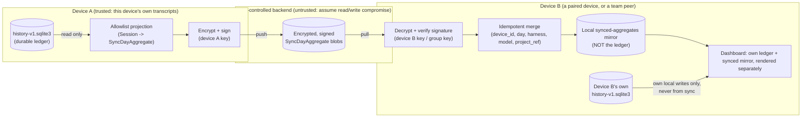
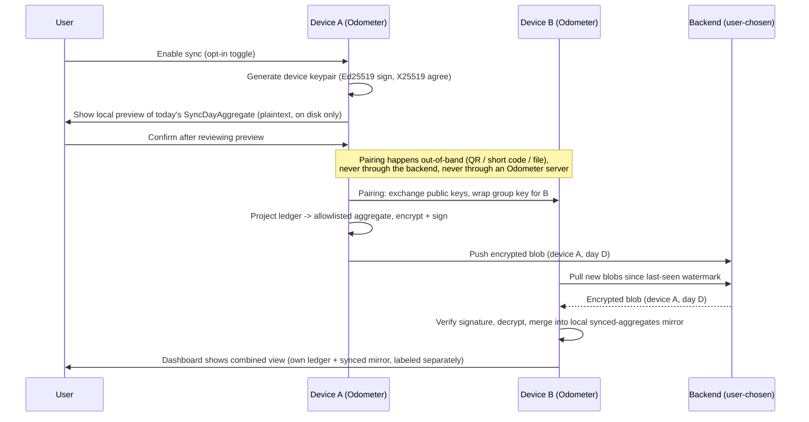

# 0002. Sync threat model and data flow

- Status: Accepted as a discovery-gate decision record. No code ships.
- Date: 2026-08-04
- Related: [0001](0001-opt-in-sync-use-cases-and-go-no-go.md),
  [0003](0003-sync-protocol-schema.md),
  [0005](0005-sync-identity-crypto-lifecycle-design.md)

## Scope

This threat model covers the personal-sync and team-aggregation designs in
0001. It does not cover: OS-level compromise of a device (an attacker with
kernel/root access on a device that has decrypted plaintext can read that
plaintext — no application-layer design defeats this), supply-chain
compromise of a dependency, physical coercion, or the Odometer auto-updater
(covered separately by the existing signed-update mechanism documented in
`docs/ARCHITECTURE.md`).

## Trust boundaries and data flow

The core structural decision this design makes: **synced data never
touches the durable ledger.** Incoming sync data lands in a separate,
purely local "synced aggregates" mirror. The ledger — the thing that holds
the facts derived from real transcripts — is written only by the existing
scan/watcher/parser path and is never mutated by anything that arrived over
the network. This is what makes "disable/delete flows do not erase the
local ledger" a structural property rather than a promise to test for.

## Trust boundary summary

| Boundary | What crosses it | What must never cross it |
| --- | --- | --- |
| Ledger → projection | Read-only access to allowlisted fields | `working_directory`, `file_path`, prompts, replies, tool output, credentials (see 0003) |
| Projection → backend | Ciphertext + minimal unavoidable envelope metadata (device id, day, harness, byte size) | Plaintext, encryption keys |
| Backend → peer | The same ciphertext, as stored | Nothing new — the backend is assumed hostile and is never trusted for correctness, only for delivery |
| Peer decrypt → synced mirror | Verified, decrypted aggregates | Anything unsigned or that fails signature verification |
| Synced mirror → ledger | **Nothing.** This edge does not exist. | Any incoming sync data of any kind |

## Enable-sync and first-sync sequence

## Threats

Each threat states the mitigation and the residual risk that remains after
mitigation. A threat model that claims to mitigate everything is not a
threat model.

### 1. Compromised storage

The backend (bucket, repo, server) is read and/or written by an attacker.

- **Mitigation:** all payloads are end-to-end encrypted before leaving the
  device (0005); the backend never holds keys or plaintext. Payloads are
  also signed, so a compromised backend that tries to inject or alter data
  produces blobs that fail signature verification on merge.
- **Residual risk:** the attacker still learns envelope metadata — device
  count, approximate upload cadence, blob sizes (loosely correlated with
  usage volume), and day-level timestamps. This is unavoidable for any
  backend that is not itself a private channel, and it is the concrete
  content of the "metadata leakage" threat below, not solved here.

### 2. Account takeover

The user's backend account (GitHub PAT, S3 credentials, self-hosted server
login) is compromised.

- **Mitigation:** Odometer never stores backend credentials in the ledger
  or in any synced payload; credentials live in OS-native secure storage,
  scoped as narrowly as the backend allows (e.g., a fine-grained PAT
  limited to one private repo). Encryption keys are independent of backend
  credentials — an attacker with only storage write access cannot read
  existing plaintext or forge validly-signed new aggregates.
- **Residual risk:** an attacker with storage write access can still delete
  or overwrite blobs (denial of service on delivery, not confidentiality),
  and can replay old, still-validly-signed blobs (see Replay/Rollback
  below). If the compromised account also grants read access to blob
  listing, the attacker learns the same envelope metadata as threat 1.

### 3. Malicious peer

A device that legitimately holds group key material (a paired personal
device, or a team member's device) submits fabricated or inflated data
under its own identity.

- **Mitigation:** every aggregate is signed by its originating device key
  and keyed by `(device_id, day, harness, model, project_ref)`; a peer can
  only write rows under its own `device_id` and cannot impersonate another
  device. A team admin can revoke a device's key, which excludes its future
  contributions and flags its past ones for review.
- **Residual risk:** nothing cryptographically ties a signed aggregate to
  the real ledger it claims to summarize — only the originating device
  itself could re-derive and check that. A trusted-but-compromised or
  dishonest peer can submit false numbers for itself indefinitely until a
  human notices an anomaly. This is the single largest reason private team
  aggregation is gated behind personal sync shipping first (0001): the
  failure mode is "a team member can lie about their own usage," and no
  part of this design removes that possibility.

### 4. Metadata leakage

Even fully encrypted payloads leak the envelope: `device_id`, `harness`,
day granularity, `project_ref` (pseudonymous, see 0003), byte size, and
upload timestamp.

- **Mitigation:** the envelope is minimized to exactly what merge/dedup
  needs (0003); day-granularity instead of per-event timestamps limits
  temporal fingerprinting; `project_ref` is a locally-salted, non-reversible
  handle, not a raw path.
- **Residual risk:** a backend operator (or anyone with read access to
  blob listings) can still build a device/team activity profile — cadence,
  approximate volume, model choice — from metadata alone, with zero content
  access. This is the accepted floor of any sync design and is exactly what
  the pre-enable preview (0003) exists to disclose to the user before they
  opt in, rather than after.

### 5. Replay

An old, unmodified, validly-signed blob is served again.

- **Mitigation:** merge is keyed and idempotent — reapplying an identical
  aggregate is a documented no-op (proved in
  `src-tauri/tests/sync_design_prototype.rs`,
  `merging_the_same_aggregate_twice_is_a_no_op`). A replay of unchanged
  data is harmless by construction.
- **Residual risk:** replay is only harmless when the replayed blob matches
  the latest known revision. Replay of a *stale* revision after a newer one
  has already been applied is the actual attack, and is covered by threat
  6 (Rollback), not by replay protection alone.

### 6. Rollback

The backend serves an earlier revision of a device's data, hiding a
correction or resurrecting deleted data.

- **Mitigation:** each aggregate carries a monotonically increasing
  per-key revision counter, set by the originating device (not wall-clock
  time, which is vulnerable to skew). A receiving device accepts a new
  revision only if it strictly advances the last-seen revision for that
  key; a stale replay is rejected (proved in
  `a_higher_revision_replaces_but_a_replayed_stale_revision_is_rejected`).
- **Residual risk:** a device syncing for the very first time has no prior
  revision to compare against, so it cannot detect a rollback that predates
  its first sync — the classic bootstrap-trust problem for any append-only
  log without an external witness/transparency service, which this design
  deliberately does not add (adding one would itself be a hosted service,
  which 0001 gates out). A backend operator with full control over their
  own storage (e.g., the owner of a self-hosted target, or the owner of a
  local-file backend) can always rewrite their own history; for a
  single-user backend this is a degenerate "attacking yourself" case, but
  for a team backend a malicious admin with bucket-owner access can rewrite
  the visible chain for other team members with nothing external to catch
  it.

### 7. Device loss

A device with sync enabled is lost or stolen.

- **Mitigation:** each device holds its own keypair; group/team key
  material is wrapped per-device (0005), so losing one device does not
  expose other devices' keys. Revocation removes the lost device's key from
  future group membership (propagated as an ordinary signed roster update,
  same mechanism as any other aggregate).
- **Residual risk:** between loss and revocation, a recovered physical
  device with an unlocked OS keychain can still read/write with the lost
  device's identity — OS-level disk encryption and screen lock are outside
  Odometer's control and must be a documented user recommendation, not an
  enforced control. Separately, if a lost device's private key had no
  backup, any of *that device's own* not-yet-synced local ledger data is
  unaffected (the ledger never depended on the sync key), but that device's
  identity in the sync group is permanently gone and must be re-paired
  under a new identity.

### 8. Deletion propagation

A user deletes synced data; peers who were offline at the time must
eventually converge on "deleted," not silently keep stale data forever.

- **Mitigation:** deletion is a signed tombstone record for a
  `(device_id, day, harness, model, project_ref)` key, applied through the
  same idempotent-merge machinery as ordinary records — an offline peer
  converges whenever it next syncs, regardless of how long it was offline.
  Tombstones apply only to the local synced-aggregates mirror; they can
  never reach the ledger (see the trust-boundary table above).
- **Residual risk:** propagation is best-effort and eventual — a peer that
  synced before the tombstone and has not synced since will keep showing
  the deleted data until its next sync. If a backend supports out-of-band
  deletion (a user manually deletes objects from their own S3 bucket
  outside Odometer), that removal produces no tombstone at all, and peers
  cannot distinguish "device stopped producing data" from "data was
  deleted" — Odometer can document that it always writes tombstones and
  never itself hard-deletes without one, but cannot enforce that on a
  backend the user directly controls (see 0004 and 0006 for the
  deletion-verifiability implications per backend).
