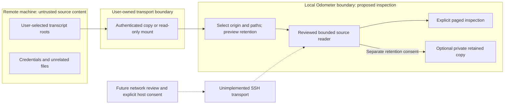

# 0008. Remote session inspection boundary

- Status: Design decision; no runtime transport, importer, or capability is enabled.
- Date: 2026-10-04
- Issue: [#261](https://github.com/ekalb81/agent-odometer/issues/261)
- Related: [#250](https://github.com/ekalb81/agent-odometer/issues/250) source access,
  [#38](https://github.com/ekalb81/agent-odometer/issues/38) retention,
  [sync decisions](0001-opt-in-sync-use-cases-and-go-no-go.md).

## Decision and evidence

Prefer a user-prepared, local copy of explicitly selected transcripts for initial
inspection. A user-managed read-only mount is an alternative with weaker offline
and latency guarantees. Do not implement an Odometer SSH transport now. There is
no recorded user interview or measured remote-workflow demand establishing that
an integrated transport is needed; the workflows below are hypotheses to validate.
If a bounded local workflow meets the need, keep transport outside Odometer.

[claude-devtools documents](https://claude-dev.tools/docs/ssh-remote) SFTP transcript
reading, SSH configuration discovery, and separate host contexts. This establishes
an adjacent feature, not a security evaluation or a reason to adopt its auth model.
This design does not recommend agent forwarding.

The existing [headless interface](../HEADLESS.md) reads a local ledger through
bounded Rust queries. It is not a remote server or raw-transcript interface. A
full ledger copy is unsuitable as a limited transcript import: local snapshots
can contain messages and paths, not just anonymous totals. Remote transcript
inspection and aggregate-only sync remain separate products and consent scopes.

## Workflows to validate

| Workflow | User intent and smallest useful result | Evidence needed before building |
| --- | --- | --- |
| Own development machine | Inspect one failed agent session after copying its transcript locally; retain the host label and capture time. | A real user can select the right file and answer their debugging question without credentials entering Odometer. |
| Short-lived CI worker | Inspect a deliberately published, access-controlled job artifact after the worker disappears. | The job owner can exclude secrets and unrelated sessions and supplies explicit provenance; artifact access alone does not establish permission to inspect other users' work. |
| Shared development host | Inspect only the requesting user's allowlisted session roots. | Ownership and authorization can be demonstrated per root. A shared home/root-wide scan is a no-go. |

Remote availability must never be a dependency of local accounting. No remote
control, command execution, harness launch, or editing of the original is part of
these workflows. Import is not automatic synchronization or accounting ingestion.

## Data flow and trust boundaries

There is intentionally no edge from unrelated files, from inspection to the
accounting ledger, or from Odometer back to the source host. Every arrow is a
test boundary in the verification table below. Copying a transcript necessarily
copies its embedded prompts, replies, tool bodies, and possible secrets; a file
extension or parser does not sanitize it.

| Choice | Data crossing into the app | Transport/auth owner | Retention and offline behavior |
| --- | --- | --- | --- |
| User-provided local copy, preferred | Only selected transcript files plus an explicit origin label/capture time. | User's existing copy tool; Odometer neither reads SSH config nor receives credentials. | Original copy remains user-owned. Odometer retention is separately previewed. Available while the copy is readable; capture age is always visible. |
| User-managed read-only mount | Requested bounded transcript pages; directory entries only within selected roots. | OS/mount tool. A filesystem operation can trigger network traffic outside Odometer. This is not an offline guarantee or an exemption from network review for an app-supported mount feature. | No automatic persistent body cache. Disconnection/timeouts become unavailable; previously viewed content is labeled captured, never current. |
| Integrated SSH/SFTP, no-go now | Only an explicitly consented host/root's bounded pages, if future review passes. | A separately reviewed native integration using host verification and a user-owned SSH agent/key store. No password/key copy into Odometer. | Default off; no background connection or reconnection after revocation. Local retention remains separately controlled. |

Never intentionally collect authentication files, environment files, private keys,
SSH agent sockets, entire home directories, sibling users' roots, or the provider's
platform configuration. Embedded secrets in selected transcripts remain sensitive:
do not log, export, index persistently, or send them to an MCP client by default.

## Identity, source safety, and lifecycle

- Assign an opaque local origin ID. A hostname, SSH alias, or path is a display
  hint, not proof of identity. Manual copies are labeled **user-asserted origin**.
  Future SSH identity must bind the verified host key, port, remote principal,
  and selected root; changed keys require a fresh explicit trust decision.
- Use origin plus provider plus source identity for inspection. Identical provider
  session IDs on two hosts must not overwrite each other. Do not auto-merge a
  copied session into local accounting; an eventual import must demonstrate
  lineage-aware deduplication separately. Retain provenance when byte-identical
  copies are recognized.
- Resolve only registered sources under canonical allowlisted roots. Reject
  traversal, symlink/junction escapes, special files, and path replacement races;
  validate the opened file as well as the candidate path. Reject archive extraction
  paths that leave the destination; do not add an archive importer incidentally.
- Reuse #250's bounded pages, stable anchors, complete-record semantics, explicit
  partial-source states, and invalidated continuations. Do not treat a changed,
  truncated, or offline file as an empty conversation or reuse another host's page.
- Default to inspection without an app-owned retained body copy. Any later retained
  copy needs a preview showing files/bytes, sensitivity, origin, retention duration,
  and deletion scope. Local #38 snapshots, indexes, annotations, and evaluation
  datasets need an explicit linked deletion policy before import can ship.
- Disconnect/revoke stops future reads and drops connection/page state; it does
  not claim to erase user-owned copies or OS caches. **Delete retained content**
  is a separate confirmed action affecting app-owned data only, with honest
  failures and no secure-erasure claim. Never delete the remote original.
- Do not persist credentials, response bodies in logs, or raw paths in diagnostics.
  Bounded codes such as `host_unavailable`, `source_changed`, and
  `path_not_allowed` suffice. Captured time and last successful contact are distinct.

## Implementation gates and verification

The design ticket can close with this reviewed record. Runtime work requires a
separate issue and decision; closing #261 does not satisfy any gate below.

| Gate / synthetic experiment | Required evidence |
| --- | --- |
| User need | Record the workflow, frequency, ownership, and why manual local copies are insufficient before proposing integrated SSH. |
| Shared reader (#250) | Inspect large/malformed files within byte and time budgets; no transcript bodies in summary, diagnostics, or MCP serialization. |
| Origin isolation | Two hosts with the same provider/session IDs remain separate; switching hosts invalidates in-flight results and cursors. |
| Filesystem boundary | Traversal, relative symlink/junction, source swap, pipe/device, overlong record, and removed mount fixtures fail closed; unrelated file sentinels are never opened. |
| Offline/cancellation | Disconnect and a hung filesystem return bounded unavailable/cancelled states without freezing the UI. Hard cancellation of a blocked native filesystem read must be demonstrated on supported platforms; a UI timeout alone is insufficient. |
| Consent/retention | Decline, revoke during read, restart, failed deletion, and explicit deletion produce the stated behavior; no implicit body cache or accounting ingestion. |
| Outbound/security review | Approve exact hosts/protocols, host-key policy, auth ownership, least-privilege paths, cancellation, resource limits, and any Tauri/native capability changes. Existing updater/status/quota exceptions do not authorize SSH. |
| Credential isolation | Synthetic credential canaries never appear in config, logs, diagnostics, exports, performance recordings, fixtures, or process arguments. |

**No-go:** if ownership, host verification, root containment, bounded cancellation,
or credential isolation cannot be demonstrated, retain the local-copy workflow
and do not ship the transport. No runtime experiments, SSH connection, credential
access, or capability changes were performed as part of this decision.
