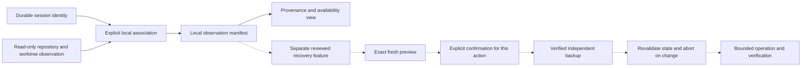

# 0009. Git-linked observations and recovery gates

- Status: Design decision; no checkpoint capture, Git write, or recovery command ships.
- Date: 2026-10-04
- Issue: [#267](https://github.com/ekalb81/agent-odometer/issues/267)
- Related: [#46](https://github.com/ekalb81/agent-odometer/issues/46) disabled-write
  guardrails, [#268](https://github.com/ekalb81/agent-odometer/issues/268) human outcomes,
  [#38](https://github.com/ekalb81/agent-odometer/issues/38) local retention.

## Decision

A read-only Git observation manifest is sufficient for the first milestone:
answer **which repository and worktree state was observed with this session?**
It is not a backup, proof of attribution, or a recoverable checkpoint. Do not
enable reset, checkout, restore, staging, commits, stash, branch movement, hooks,
subprocess automation, or harness resume through this design.

[Entire CLI](https://github.com/entireio/cli) documents session context linked to
Git checkpoints and recovery. It motivates examining the workflow but does not
prove that Odometer can preserve arbitrary dirty state or replay a session.
Runtime behavior of Entire was not tested for this decision.

Current `git_outcomes.rs` observes local HEAD-reachable commits within a session
time window and reports ambiguous overlaps. Its durable `session_id` and existing
repository discovery are reusable references, but an outcome such as `kept` is
observational: it neither proves that the agent authored the commit nor that a
user accepted the task. Do not overwrite these outcomes with manifest state or
use a Git commit as #268's accepted-outcome label.

## Observational milestone

On an explicit user action, a future implementation may save a small local
manifest, separate from Git and provider transcripts. No automatic hook is needed.
Reuse the existing Git library, project identities, and durable session identity;
do not create a second Git-outcome analysis path.

| Field | Meaning / boundary |
| --- | --- |
| Schema version, manifest ID, UTC observation time | Versioned local record; independent of commit timestamps. |
| Durable session ID and association provenance | A user-selected association or recorded working-directory evidence, never authorship proof. Missing or ambiguous association is explicit. |
| Opaque local repository and worktree IDs | Repository identity resolves common Git storage; worktree identity distinguishes linked checkouts. Keep private canonical paths in local lookup storage only. Remote URLs and repository names are insufficient identity. |
| HEAD object ID and symbolic ref, if any | Detached HEAD and unborn branch are explicit states; object IDs may later become unreachable. |
| Index/working-tree observation | Tracked staged/unstaged counts plus a bounded state digest if a complete read succeeds. Partial/racing/permission-denied state has no complete digest. File contents and diffs are excluded. |
| Untracked/ignored coverage | Default `not_captured`; optionally bounded counts with separate explicit inspection. Do not walk ignored trees or claim their absence from a tracked-file scan. |
| Scope and availability | Object format, submodule/nested-repo boundaries, scan budget, observed generation, and warnings. Unsupported repositories are unavailable, not clean. |
| Recoverability | Always `observation_only` for this milestone. A reachable commit proves only availability of that commit's tree, not dirty files or runtime state. |

Even private paths, filenames, branch names, and content hashes can disclose
information. Store only the minimum locally, exclude them from diagnostics and
ordinary aggregate exports, and let #38's explicit annotation/manifest policy
control retention and deletion. Never insert a manifest into a tracked repository
file or an agent's transcript. Missing sessions or moved repositories become
unresolved references; never bind them to a new same-named repository automatically.

Solid arrows describe the proposed read-only milestone. Dotted arrows are an
unimplemented, separately gated recovery proposal. A session deep link is
navigation only and must not imply that a harness resumes, that its context is
restored, or that external side effects can be replayed safely.

## Any future recovery transaction

Prefer opening a separate recovery worktree from an available commit over
rewriting an active checkout. Creating that worktree is still a write requiring
its own exact preview and explicit confirmation. No recommendation here bypasses
the disabled-write contract in #46.

1. Resolve and verify the exact repository, worktree, object format, and target
   object. Show source/target IDs, changed paths, staged/unstaged effects, and all
   uncaptured state. A stale manifest is evidence, not authorization.
2. Establish a complete, fresh state inventory for the proposed write scope.
   Refuse unmerged indexes, active Git operations, unhandled submodules, nested
   repositories, symlink escapes, unsupported permissions, or incomplete scans.
   Never silently stash, clean, discard, or stage unrelated changes.
3. Present an immutable preview bound to an operation ID, source-state digest,
   destination, target object, and bounded file set. Obtain explicit confirmation
   for this mutating action; past consent, a generic enable toggle, or confirming
   a different restore is insufficient. Changed previews require new confirmation.
4. Before modifying the destination, create and verify a private backup outside
   the mutation scope. It must reproduce tracked contents, index stages/modes,
   untracked collision paths, and relevant metadata, with byte/object checks.
   Ignored files remain excluded unless explicitly selected; if an excluded file
   could be overwritten, refuse the operation. Missing space, permissions, or
   unsupported metadata are blocking failures. A stash alone is not a full backup.
5. Revalidate immediately before writing; hold the operation's required locks.
   Git's index/ref locks do not lock editor writes. If protection against concurrent
   file edits cannot be demonstrated, refuse in-place recovery and use an isolated
   destination. A preflight hash comparison alone does not eliminate that race.
6. Apply only the confirmed operation, verify the resulting state, and retain the
   backup/journal until explicit cleanup. No shell interpolation, user hooks, Git
   aliases, filters, credential helpers, fetch, push, or remote URL execution may
   be an incidental side effect. Backend support must demonstrate this boundary.
7. On failure, report what changed and where the backup is. Automatic rollback
   may restore only bytes still matching this operation's writes. Preserve any
   intervening user edit; stop and offer a fresh recovery preview if there is a
   conflict. A crash/restart reads the bounded journal without rerunning the write.

## Risk and verification matrix

| Risk | Required behavior / future synthetic check |
| --- | --- |
| Same repository name, different clone; linked worktrees | IDs bind verified local storage and distinct worktrees; no name/path-only automatic reassociation. Move/replacement fixtures require revalidation. |
| Staged and unstaged changes to the same path | Preserve both layers in an independently verified backup; inspect restoration of each layer, not just final working bytes. |
| Untracked or ignored file collides with target tree | Refuse unless explicitly included in a confirmed, verified backup; never implicit `clean`, glob deletion, or overwrite. |
| Editor/agent changes after preview | Invalidate preview or choose an isolated destination. Test edits before validation, during backup, before write, and during rollback. |
| Another Git operation or changed branch/HEAD | Refuse or cancel; locks and target identity must remain valid. Test unborn/detached HEAD and unresolved merges. |
| Lost/pruned commit or shallow history | Mark unavailable; do not fetch automatically or invent recoverability. |
| Submodules, LFS, nested repos, sparse checkout, special files | Declare unsupported until specifically covered. A superproject commit is not a backup of independent working trees or external LFS objects. |
| Partial write, power loss, full disk, failed rollback | Preserve recovery evidence; restart must neither repeat the action nor overwrite later edits. Verify backup restoration with synthetic dirty/untracked data. |
| Private content in backup/manifest | Private permissions and explicit retention/deletion; no prompts, credentials, source bodies, or unrestricted paths in telemetry/export. Backup creation never becomes consent to publish. |
| Mistaking correlation for success or replay safety | Display association provenance and `observation_only`; tests reject an automatic accepted-outcome label or enabled resume action. |

## Exit criteria and order

This document and independent review complete the design-only #267 deliverable.
No code or successful recovery experiment is claimed. A future observational
implementation needs a separate issue covering bounded scans, explicit partial
states, sensitive metadata, stable identities, and serialization regression tests.

A later write-capable proposal additionally needs maintainer approval of the
exact mutation scope, a security/data-loss review, platform-specific backup and
concurrency demonstrations, native preview/confirm/cancel tests, and every failure
experiment above. #46's existence or completion cannot enable it implicitly.
If complete backup or concurrent-edit protection cannot be proved, the decision
is **no-go for in-place recovery**. Keep the observation view and direct the user
to their existing recovery tools; do not advertise the manifest as a checkpoint.
