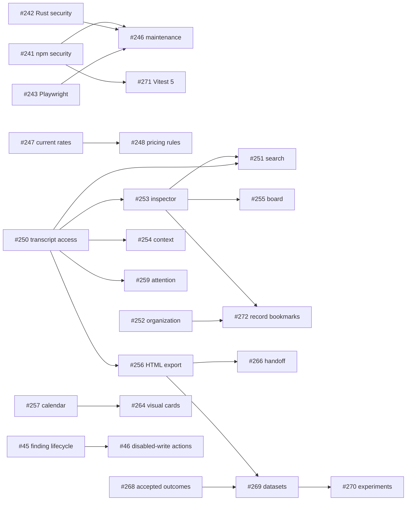

# Implementation plan: October 4 GitHub comparison and related audit

Tasks are tracked in [GitHub roadmap #36](https://github.com/ekalb81/agent-odometer/issues/36). GitHub issue bodies, priority labels, parent links and blocked-by relationships are the live source of truth; this file is an index, not a second task checklist.

Evidence: [GitHub comparison](../docs/GITHUB_FEATURE_GAPS_2026-10-04.md), baseline v0.8.20 / d1f011da01b17289737d94e4e1ce9acf7df61476, and the related Codex chat “Audit dependencies and model pricing.” The comparison used primary project docs/source. Competitors were not runtime-tested; the related audit’s dated candidates must be rechecked when implemented.

## Ordered task index

| Stage | Issues | Order and parallel work |
| --- | --- | --- |
| Immediate security | [#241](https://github.com/ekalb81/agent-odometer/issues/241) npm; [#242](https://github.com/ekalb81/agent-odometer/issues/242) Rust | Independent lanes; each owns its lockfile integration |
| Accounting corrections | [#247](https://github.com/ekalb81/agent-odometer/issues/247) catalog; [#248](https://github.com/ekalb81/agent-odometer/issues/248) surfaces/rules; [#249](https://github.com/ekalb81/agent-odometer/issues/249) saved-card upgrade | Catalog and migration can start together; integrated rules follow catalog; verify existing installations before release |
| Reliability | [#243](https://github.com/ekalb81/agent-odometer/issues/243) Playwright; [#244](https://github.com/ekalb81/agent-odometer/issues/244) Windows sampler; [#245](https://github.com/ekalb81/agent-odometer/issues/245) Cargo resolution | Independent investigations; coordinate package/Cargo lockfiles with security work |
| Existing commitments | [#38](https://github.com/ekalb81/agent-odometer/issues/38) retention/recovery; [#43](https://github.com/ekalb81/agent-odometer/issues/43) quota/accounts; [#57](https://github.com/ekalb81/agent-odometer/issues/57) guided integration | Existing foundations are delivered; no blanket dependency on completing every other parent |
| Retrieval foundation | [#250](https://github.com/ekalb81/agent-odometer/issues/250) transcript access; [#252](https://github.com/ekalb81/agent-odometer/issues/252) session organization; [#257](https://github.com/ekalb81/agent-odometer/issues/257) calendar | Can start in parallel after agreeing shared identities and migration ownership |
| Retrieval delivery | [#253](https://github.com/ekalb81/agent-odometer/issues/253) inspector; [#251](https://github.com/ekalb81/agent-odometer/issues/251) search; [#272](https://github.com/ekalb81/agent-odometer/issues/272) message bookmarks; [#254](https://github.com/ekalb81/agent-odometer/issues/254) context; [#255](https://github.com/ekalb81/agent-odometer/issues/255) execution board | Inspector follows transcript access; search/board follow inspector; bookmarks additionally need organization |
| Export and handoff | [#256](https://github.com/ekalb81/agent-odometer/issues/256) sanitized HTML; [#266](https://github.com/ekalb81/agent-odometer/issues/266) handoff | Export follows transcript access; handoff follows export |
| Ambient and interfaces | [#258](https://github.com/ekalb81/agent-odometer/issues/258) widgets; [#259](https://github.com/ekalb81/agent-odometer/issues/259) attention; [#260](https://github.com/ekalb81/agent-odometer/issues/260) status; [#264](https://github.com/ekalb81/agent-odometer/issues/264) cards; [#263](https://github.com/ekalb81/agent-odometer/issues/263) editor | Attention follows transcript access; cards follow calendar; offline widgets/status/editor have no hard blockers |
| Adapter evidence | [#262](https://github.com/ekalb81/agent-odometer/issues/262) more harnesses | Source-format discovery first; create linked implementation slices for supported evidence |
| Workflow and evaluation | [#45](https://github.com/ekalb81/agent-odometer/issues/45) finding lifecycle; [#46](https://github.com/ekalb81/agent-odometer/issues/46) disabled-write action contract; [#268](https://github.com/ekalb81/agent-odometer/issues/268) outcomes; [#269](https://github.com/ekalb81/agent-odometer/issues/269) datasets; [#270](https://github.com/ekalb81/agent-odometer/issues/270) experiments | #46 follows #45. Outcomes can proceed independently; datasets need outcomes and sanitized export; experiments need datasets |
| Maintenance | [#246](https://github.com/ekalb81/agent-odometer/issues/246) compatible updates; [#271](https://github.com/ekalb81/agent-odometer/issues/271) Vitest 5; [#54](https://github.com/ekalb81/agent-odometer/issues/54) TypeScript 7; [#78](https://github.com/ekalb81/agent-odometer/issues/78) CI image measurement | #246 follows security/Playwright; #271 follows npm security; existing #54/#78 gates unchanged |
| Later expansion | [#261](https://github.com/ekalb81/agent-odometer/issues/261) remote design; [#267](https://github.com/ekalb81/agent-odometer/issues/267) checkpoint design; [#265](https://github.com/ekalb81/agent-odometer/issues/265) TUI | P3; designs can start independently but do not authorize runtime SSH or recovery writes |

Pricing epic: [#42](https://github.com/ekalb81/agent-odometer/issues/42). Ambient epic: [#48](https://github.com/ekalb81/agent-odometer/issues/48). All 18 comparison gaps and related audit findings are mapped in [#36](https://github.com/ekalb81/agent-odometer/issues/36).

## Dependency graph

Arrows mean prerequisite → dependent. Disconnected starting nodes can be prepared in parallel; shared-file integration still needs one owner.

## Integration checkpoints

The corresponding checkpoint checklist lives in [#36](https://github.com/ekalb81/agent-odometer/issues/36).

1. Security/accounting: current audit evidence, reproducible locked builds, saved-card migration, frozen pricing oracles and generated fixture verification.
2. Retrieval: bounded source access, inspector and search navigation across present/missing/retained sources; stable anchors and privacy boundaries.
3. Ambient: shared scope/timestamp reconciliation, honest offline/stale states, opt-in alerts and status separated from accounting.
4. Evaluation: explicit human outcomes, curated dataset versions, frozen comparison evidence and complete denominators.

For implementation, follow AGENTS.md validation and change-specific checks. This planning change does not modify application code or claim that any proposed capability is delivered.

## Architecture and coordination

Rust remains responsible for filesystem access, parsing, persistence and pricing; UI and additional clients use typed bounded services. Keep SessionSummary lightweight, full transcripts lazy, and the ledger authoritative for historical usage. Coordinate ledger migrations, rate/query oracles, lockfiles, and shared detail/tray components through a single integrator for each surface.

Feature7 lives in the existing quota issue [#43](https://github.com/ekalb81/agent-odometer/issues/43), including account identity and consent isolation. The evaluation tickets #268–270 are children of #36 rather than #45, so later experiments cannot block the original finding-lifecycle requirement or #46.

Existing network and mutation decisions remain in force: signed cards use the existing updater, public provider status is opt-in, live quotas require per-provider/account consent, #46 mutations remain hard-disabled, and remote/checkpoint designs do not enable their runtime behavior. The sync decision in #49 remains design-only and its anonymous leaderboard remains no-go.

## Publication record

32 new issues (#241–#272); eight existing issues updated (#36, #38, #42, #43, #45, #46, #48, #57). Live verification on October 4 confirmed all 40 expected bodies/titles/priority labels, 32 native parent links, 20 native dependency links, an acyclic dependency graph, and coverage of all 18 feature gaps. The other 58 pre-existing issues retained their titles, bodies, states and labels. Priorities: P0 immediate/established release commitments; P1 core next work; P2 follow-ons; P3 later discovery/expansion.

